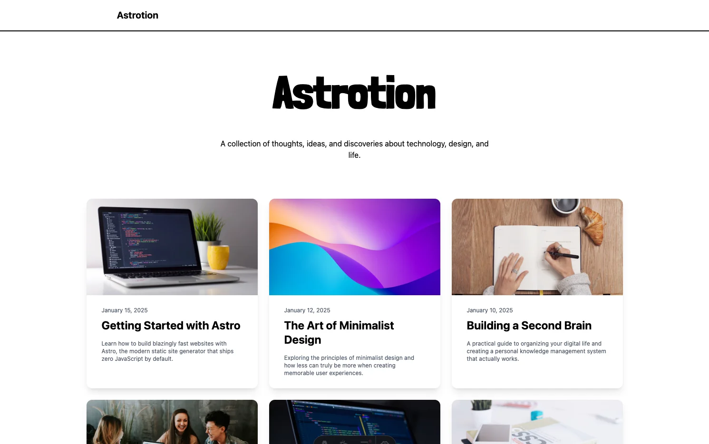

# Astrotion

Astro + Notion + Blog

## What is different from [astro-notion-blog](https://github.com/otoyo/astro-notion-blog)?

- Stylish theme inspired by [Creek](https://github.com/robertguss/Astro-Theme-Creek)
- 100% TypeScript ready
- Easy to customize
- Simpler implemetation: Notion's rendering is achieved simply by markdown-izing pages
- Notion cache ready: it works on Cloudflare Pages
- Support Astro v5 and TailwindCSS v4

💡 Powered by [notiondown](https://github.com/rot1024/notiondown)

## Features

- Fetching Notion pages in a database
- Cache Notion pages automatically and reduce build time
- Downloading images in Notion pages automatically
- Basic blocks support
- Code syntax highlighting
- Math equation rendering
- Automatic OG image generation

## Customization

These files can be customized without concern for conflicts:

- `public/*`
- `src/customization/*`

## Showcase

- [Re:Earth Engineering](https://reearth.engineering)

## Getting Started

### 1. Use this template

Click the "Use this template" button on GitHub to create your own repository.

### 2. Set up Notion

1. Duplicate [this blog template](https://rot1024.notion.site/2f4e5259d70480dab0a0d777e7afe553?v=2f4e5259d704800999db000c50218134) to your Notion workspace
2. Customize the icon, title, and description as you like
3. Note the `DATABASE_ID` from your page URL: `https://notion.so/your-account/<DATABASE_ID>?v=xxxx`

### 3. Create a Notion Integration

1. Go to [My Integrations](https://www.notion.so/my-integrations) and create a new integration
2. Copy the "Internal Integration Token" as `NOTION_API_SECRET`
3. Go back to your Notion database page, click "..." → "Connections" → "Connect to" and select your integration

### 4. Deploy to Cloudflare Pages

1. Go to [Cloudflare Pages](https://pages.cloudflare.com/) and create a new project
2. Connect your GitHub repository
3. Set the following environment variables:
   - `NOTION_API_SECRET`: Your Notion integration token
   - `DATA_SOURCE_ID`: Your Notion database ID
4. Click "Save and Deploy"

### 5. Publish new posts

After publishing a new post in Notion, you need to trigger a new deployment. You can do this manually from the Cloudflare Pages dashboard, or set up automatic deployments using GitHub Actions or webhooks.

## TODO

- [ ] Mermaid rendering
- [ ] Fix links to pages in paragraph blocks
- [ ] Support embed and bookmark blocks
- [ ] Search
- [ ] Related Posts
